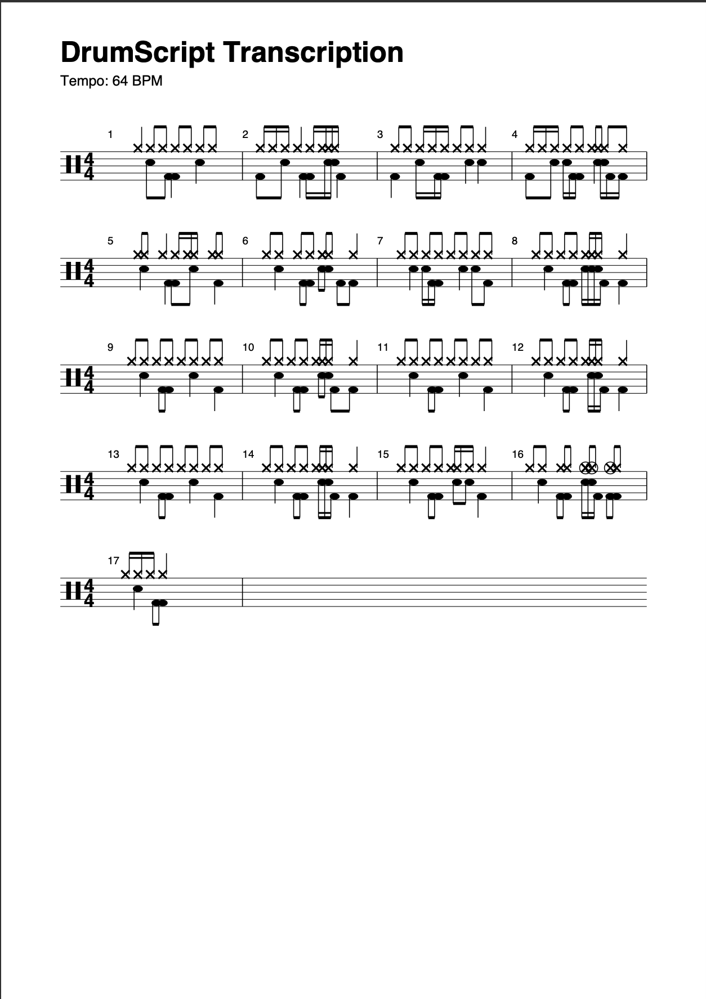
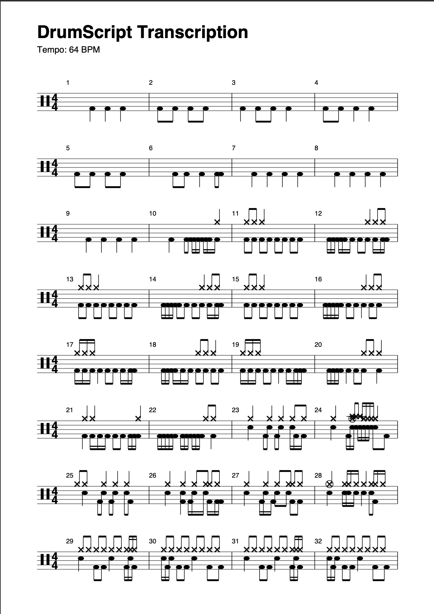
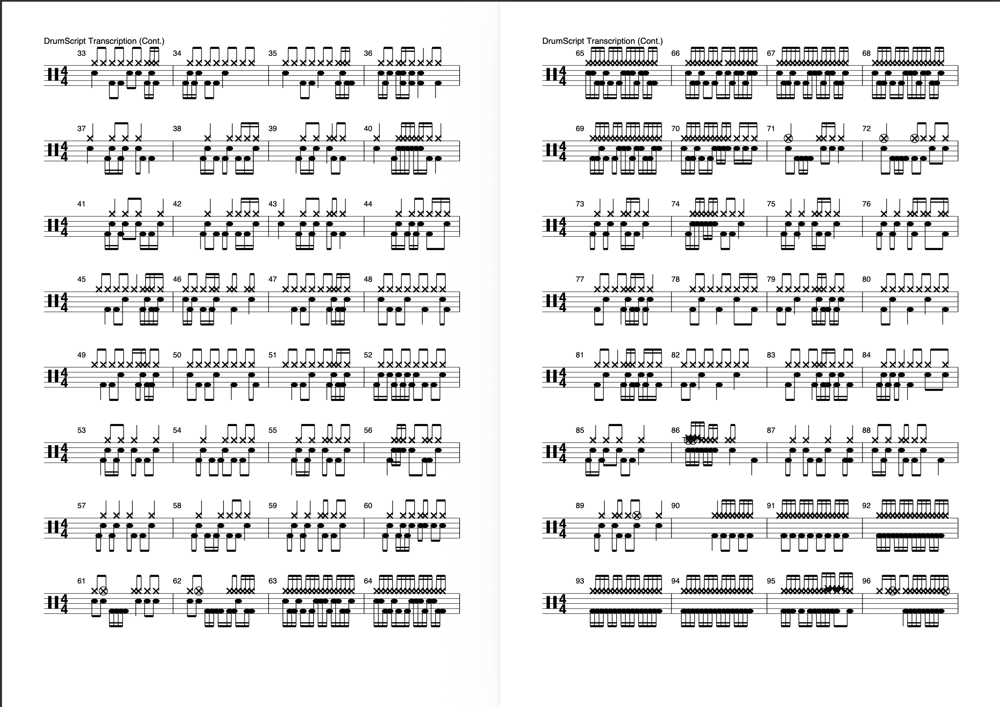
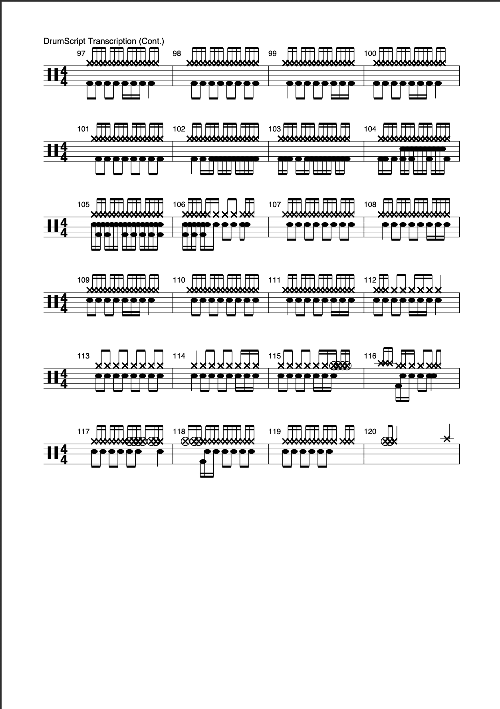

# `DrumScript` Documentation

<!--date_created:tuesday-30-december-2025-->
<!--date_updated:weds-25-august-2026-->

<!-- **[repo stats](https://github.com/DrumScript/DrumScript/blob/github-repo-stats/DrumScript/DrumScript/latest-report/report.pdf)**-->
 
**DrumScript** is an open-source Python library and CLI tool for drum audio analysis and transcription. Give it a recording - a full mix or an isolated drum stem - and it will generate PDF sheet music, MIDI files, and MusicXML output. The `DrumScript` model is a **deterministic classifier**, and doesn't use AI/machine learning. Built for drummers and by drummers, it is - and always will be - an open-source community tool. The alpha has been running since **01 June 2026** and will be ongoing until we make the model and transcription process more accurate. 

**Disclaimer**
> * `DrumScript` is developed by part-timers who have full-time jobs and, like most modern software, it's built with the help of good tooling and occasional use of LLM for debugging and refining website content, but all the decisions are human-reviewed more than once at every step.
> * The deterministic classification model (classify.py) has been built from a relatively small dataset covering different genres, but with a notable focus on **fast-paced, technical death metal** songs and drumming
> * The prioritisation of speed versus accuracy means the score generation needs work. 
> * Moreover, as our [roadmap](./docs/guide/roadmap.md) points out, increasing DrumScript's accuracy for all genres and drumming styles, including better score generation is an important long-term goal
> * The core classification model does NOT use machine learning in classifying onset_events into drum parts. This is what makes the DrumScript package unique: it uses physics-only derived and measured inputs based on the individual features of each part of the drumkit. 
> * The PDF generation uses ReportLab to build a custom PDF; it does not use librosa or MuseScore
> * Accuracy of onset detection, sonic properties of deterministic model and score generation are the three main areas we need to improve. 
> * `GitActions[Bot]` is used in the automated daily workflow that gathers repository statistics: [**repo-stats**](https://github.com/DrumScript/DrumScript/blob/github-repo-stats/DrumScript/DrumScript/latest-report/report.pdf)
> * If you feel any part of this hasn't been made clear, then please raise it in the **[Discussions](https://github.com/orgs/DrumScript/discussions)**

> **Python >=3.9, < 3.13**

> **[Try DrumScript In Colab](https://colab.research.google.com/drive/15yBGu6WURPyiH-sEQ82g_2T2wKqiIPsq)**
>
> <a href="https://colab.research.google.com/drive/15yBGu6WURPyiH-sEQ82g_2T2wKqiIPsq" target="_parent"></a>


| # | Feature | What it does |
|---|---------|-------------|
| 1 | **Transcription** | `DrumScript` converts drum audio → PDF sheet music . The `--full-song` flag also means you can give it a full song and it will extract the drums **and** transcribe|
| 2 | **Stem Separation** | Extracts drums from `.wav` and `.mp3`^ songs. Also supports extraction of bass, vocals, and other instruments |
| 3 | **Backing Tracks** | Give `DrumScript` a song and it will mute the drums to create a backing track for you|
| 4 | **Tempo Detection** | `DrumScript` estimates BPM from drum audio file based on tempogram-anaysis |

*^ `.mp3` requires `.ffmpeg` (`brew install ffmpeg`)*

Unlike most ADT systems, DrumScript's classification engine is **deterministic**. `DrumScript` combines physics-derived spectral analysis: fundamental frequency, spectral centroid, energy ratios, and decay characteristics, applied through a rule-based pipeline built on `librosa` and `Demucs`. It also functions as a general-purpose audio toolbox: stem separation, drumless/bassless backing track generation, and tempo detection. 

The project was born from one working drummer's desire to make playing drums more fun and in an accessible way - it's taken almost a year to build. **v{{ version }}** is part of the the **Alpha release**. The alpha phase began in **June 2026** and is ongoing; we expect it to run through late 2026 and into 2027 - Beta (`1.0.0`) is targeted on API stability and benchmark validation rather than a fixed calendar date. In the meantime, we are reaching out to communities, both musicians and academics alike, to find people to test  - and hopefully improve - the deterministic classification model. For more info on where this is headed see **[roadmap](guide/roadmap.md)** or **https://github.com/orgs/DrumScript/discussions**

## **What can DrumScript do?**

### 1. Audio-to-Sheet Music (Transcription)
Give DrumScript a recording of a drum beat, and it will generate a **PDF Score**.
* **Smart Detection:** Uses signal processing to detect Kicks, Snares, and Hi-Hats.
* **Tempo Aware:** Automatically calculates BPM.
* **Customizable:** Supports custom time signatures (e.g., `3/4`, `6/8`).

### 2. Stem Splitting (The "De-Mixer")
Powered by **Demucs** (Hybrid Transformer Source Separation), DrumScript can un-mix a full song.
* **Isolate Drums:** Extract *just* the drum track from a full mix to study the groove.
* **Isolate Bass:** Extract *just* the bass line to practice locking in.
* **Separate Everything:** Explode a song into 4 stems: `Drums`, `Bass`, `Vocals`, `Other`.

### 3. Backing Track Generator
Want to play along to your favorite song but the drums are in the way?
* **Drumless Tracks:** Automatically remove the drums from any `.mp3` or `.wav` to create a play-along track.
* **Bassless Tracks:** Mute the bass to practice your low-end theory.

### 4. Automatic Tempo Detection
Need to know the speed of a groove or drum loop? DrumScript can accurately estimate the global tempo of any percussive track.
* **Tempogram-First Approach:** Calculates the Beats Per Minute (BPM) by generating a tempogram from the onset strength envelope
* **Automatic Tempo Detection:** DrumScript automatically detects/calculates tempo when you provide a drum-only audio input. However, you can enforce a **global tempo** using the --tempo flag in transcribe() and the score generation will be built based on this. 

`DrumScript` is an open-source Python library that converts drum audio (in `.mp3`, or `.wav`) to `.pdf` sheet music. It contains functions for you to **automatically measure tempo of drum-only audio using Tempogram-first principles**. `DrumScript` is unique to any other library because **we do not use machine learning or AI**. Our classification approach is a **deterministic** one. 

`DrumScript` also **extracts** drum audio from **any** `.mp3` or `.wav` audio file for you. Give it your favourite track, and it will do the job of extracting **just the drum audio** and then transcribe into handy `.pdf` sheet music. There **stem-splitter** functionality also extracts, optionally, the **non-drum-parts** of an audio track and provides it as a **backing track** for all you aspiring drummers and percussionists to play along to. 

> We are currently working on academic papers related to the deterministic method(s) used and will publish here in future
> There is also the plan to integrate the **backing track extraction**, **drum only extraction**, **tempo detection** and **classification** functions to a free-to-use UI that does not require login or store any of your uploads, nor their resultant outputs. More information will be provided soon! 
> In the meantime, if you would like to be involved, get in touch! 🥁🚀 

`DrumScript` was built for drummers, by drummers. It is - and always will be - a community-owned tool. 


**Example outputs**

**Example 1: Simple groove**



**Example 2: A well-known Sabbath song**






---

## About

```{toctree}
:maxdepth: 1
:caption: Project Info
about
```

## API Reference

```{toctree}
:maxdepth: 1
:caption: API Reference

api
```

## Development

```{toctree}
:maxdepth: 1
:caption: Development

development/code_of_conduct
development/contributor_guidance
development/documentation
development/testing_guidance
```

## Getting Started

```{toctree}
:maxdepth: 1
:caption: Getting Started

guide/installation
```

## Release Notes


```{toctree}
:maxdepth: 1
:caption: Versions

release_notes/index
changelog
```

## Runbooks

```{toctree}
:maxdepth: 2
:caption: Runbooks

guide/interactive/index
```

## Theory

```{toctree}
:maxdepth: 1
:caption: Theory

theory/bibliography
theory/drum_notation_guide
theory/digital_signal_processing
theory/how_it_works
theory/percussion_frequencies
theory/tempo_estimation
theory/stem_splitting
theory/sources
```

## User Guide

```{toctree}
:maxdepth: 1
:caption: User Guide

guide/cli_reference
guide/configuration
guide/glossary
guide/roadmap
guide/security
guide/usage
```